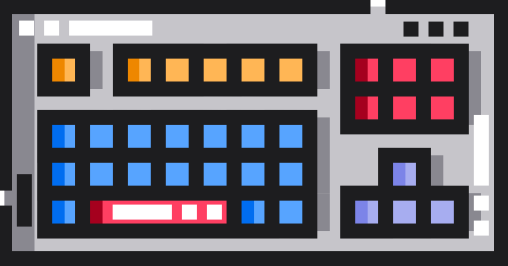

# Algorithm-study  
---
# algo-boys
## _jinho_ 
## _siwon_ 
## _seungoh_ 
---
# algo-girl
## _nayoung_ 👩‍💻
---

# Stack
* 스택 수열(실버2) https://www.acmicpc.net/problem/1874
* 괄호(실버4) https://www.acmicpc.net/problem/9012
* 쇠막대기(실버3) https://www.acmicpc.net/problem/10799
* 외계인의 기타 연주(실버1) https://www.acmicpc.net/problem/2841

# Queue
* 카드 2 (실버 4) https://www.acmicpc.net/problem/2164
* 프린터 큐(실버 3) https://www.acmicpc.net/problem/1966
* 칠무해 (실버 5) https://www.acmicpc.net/problem/14729
* 회전하는 큐 (실버 4) https://www.acmicpc.net/problem/1021

# Graph (DFS,BFS)
* 바이러스(실버3) https://www.acmicpc.net/problem/2606
* 촌수계산(실버2) https://www.acmicpc.net/problem/2644
* 연결 요소의 개수(실버2) https://www.acmicpc.net/problem/11724
* 케빈 베이컨의 6단계 법칙(실버1) https://www.acmicpc.net/problem/1389
### 도전문제
* 토마토(골드5) https://www.acmicpc.net/problem/7569
* 이분그래프(골드4) https://www.acmicpc.net/problem/1707

# Greedy
* 설탕배달(실버4) https://www.acmicpc.net/problem/2839
* A -> B(실버2) https://www.acmicpc.net/problem/16953
* 잃어버린 괄호(실버2) https://www.acmicpc.net/problem/1541
* 회의실 배정(실버1) https://www.acmicpc.net/problem/1931
## 도전문제
* 신입 사원(실버1) https://www.acmicpc.net/problem/1946
* 카드 정렬하기(골드4) https://www.acmicpc.net/problem/1715

# Tree

# BFS/DFS
* DFS와 BFS (실버 2) https://www.acmicpc.net/problem/1260
* 미로 탐색 (실버 1) https://www.acmicpc.net/problem/2178
* 나이트의 이동 (실버 1) https://www.acmicpc.net/problem/7562
* 효율적인 해킹 (실버 1) https://www.acmicpc.net/problem/1325
### 도전문제
* 파이프 옮기기 1 (골드 5) https://www.acmicpc.net/problem/17070
* 여행 가자 (골드 4) https://www.acmicpc.net/problem/1976

# Heap

# Dynamic Programming

# Search

---
###### image credit
###### <a href="https://www.flaticon.com/free-icons/keyboard" title="keyboard icons">Keyboard icons created by Freepik - Flaticon</a> 
###### <a href="https://www.flaticon.com/free-icons/hacker" title="hacker icons">Hacker icons created by Freepik - Flaticon</a> 
###### <a href="https://www.flaticon.com/free-icons/programmer" title="programmer icons">Programmer icons created by juicy_fish - Flaticon</a> 
##### <a href="https://www.flaticon.com/free-icons/avatar" title="avatar icons">Avatar icons created by Freepik - Flaticon</a> 
